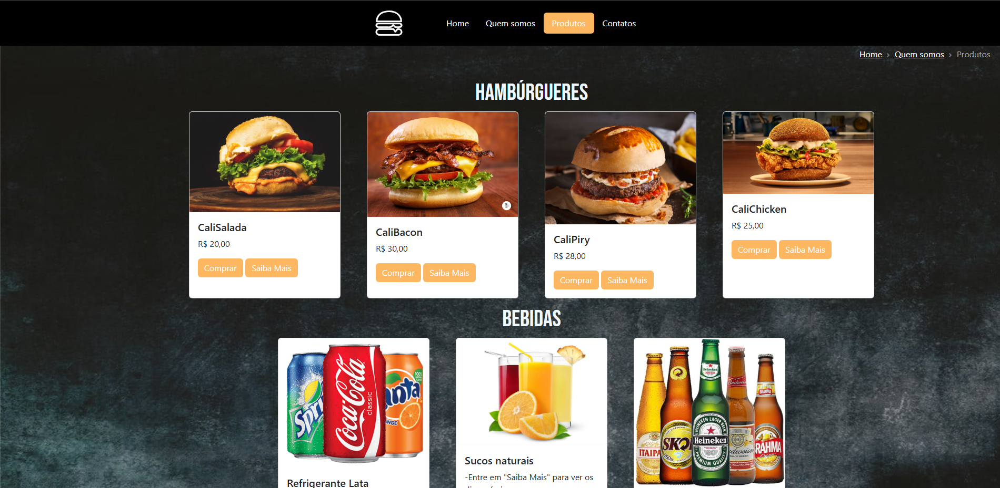
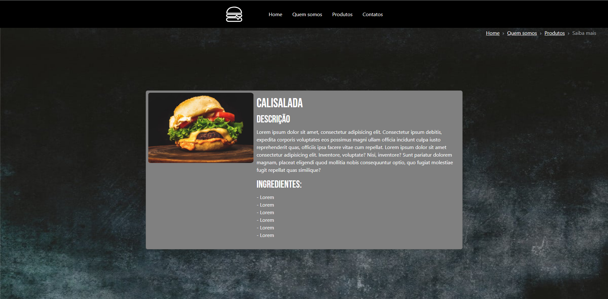

# Simulação do site de uma hamburgueria
Essa foi uma atividade que eu fiz, e o objetivo dela é a criação de um site de uma hamburgueria fictícia. Utilizei nessa atividade o HTML, CSS e a ajuda do Bootstrap.
## Etapas implementadas:
Ao longo do site, fui construindo minhas ideias, pegando referências e utilizando o Bootstrap para ver a melhor maneira de colocar em prática minhas ideias.
- CABEÇALHO  
Na primeira parte do projeto eu criei algumas das páginas que eu já saberia que seriam necessárias, como "Home", "Quem Somos?", "Produtos" e "Contatos". Após a criação dessas páginas, eu fui criando o cabeçalho, que é o mesmo para cada uma das páginas. Utilizei o componente do bootstrap `Navs & tabs`.
- BACKGROUND E DEFINIÇÃO DO CONTEÚDO  
Após isso, eu precisei pensar no que seria o fundo do meu site e definir quais seriam os conteúdos que cada página precisaria.
   
- PÁGINA "HOME"  
Coloquei apenas uma logo do restaurante e utilizei o componente do bootstrap `Carousel` com algumas imagens de hambúrgueres.
- PÁGINA "QUEM SOMOS?"  
Utilizei novamente o componente `Carousel`, mas agora com imagens que simulam o estabelecimento. Também fiz um texto com a história, criadores e localização do restaurante.
- PÁGINA "PRODUTOS"  
Dessa vez, usei o componente `Card` do bootstrap. Utilizei para fazer o que seria tipo o cardápio.
- PÁGINA "COMPRAR"  
Fiz uma página de agradecimento para que quando o usuário comprar o produto, ele ser enviado diretamente para ela.
- PÁGINA "SAIBA MAIS"  
Nessa página, também utilizei o componente `Card`, so que de um modelo diferente, dessa vez no horizontal.
Nesse card coloquei uma imagem e um local para informações sobre o produto. Essa página foi feita para quando o usuário clicar em "Saiba Mais".
- PÁGINA "CONTATOS"  
Usei o componente `Form control` para criar um pequeno formulário. E nessa página eu solicito que o usuário informe o nome, email e um pequeno texto explicando o motivo do contato, e pedindo que ele qguarde que a hamburgueria irá entrar em contato por email.

## Backlog
Há muitas melhoras necessárias no site. Esse foi um modelo bem simples que consegui criar.
- Melhora na parte de Design
- Simplificação no projeto em HTML e CSS
- Pagina onde solicita o pagamento do usuário

## Conclusão:
Por fim, esse foi o resultado do meu site, depois de muitas tentativas e erros. Consegui chegar em um resultado final que me agradou ao menos um pouco.  

